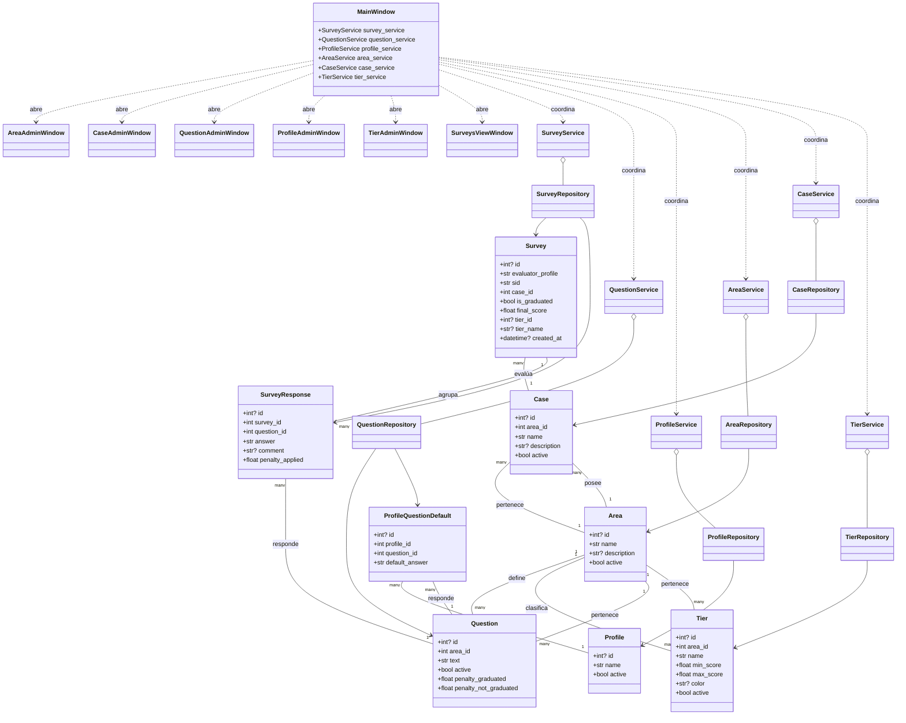

# Diagrama UML en Mermaid

El siguiente diagrama resume las principales relaciones entre la interfaz (`MainWindow` y módulos de administración), la capa de servicios, los repositorios y los modelos de datos.

